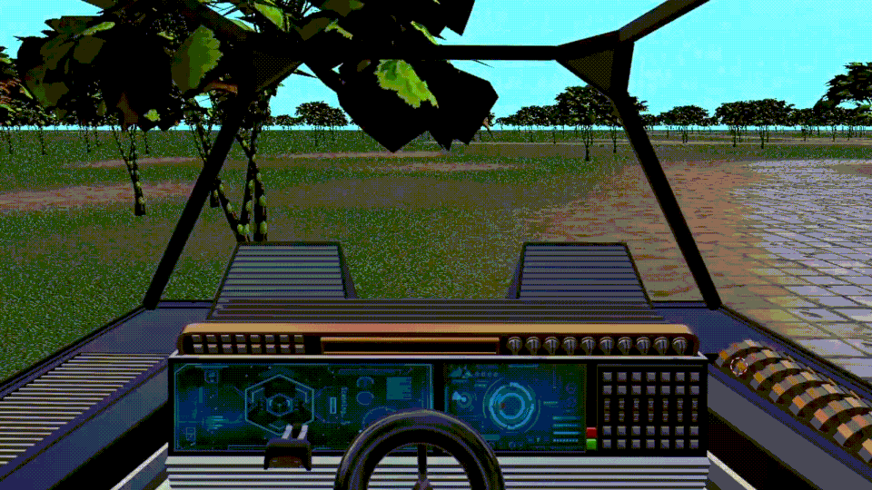

# 🚀 Cosmic Explorer  
*A 3D Java Space Adventure*  

[](https://www.youtube.com/watch?v=8HnaP_dmnYU)

[](https://cosmicexplorer2800.my.canva.site/)

[](docs/Cosmic%20Explorer_Report.pdf)

 
*Delta spacecraft cockpit with solar system view*

## 🌌 About  
**Cosmic Explorer** is an immersive 3D space adventure developed for COMP2800 at BCIT. Players:  
- Pilot the **Delta spacecraft** through a realistic solar system  
- Discover a morphing black hole triggering a dimensional warp  
- Transition to a whimsical 2D farm world with mutant animals  
- Built with **Java3D** (solar system) + **LWJGL** (farm world)  

**Key Achievements**:  
✔ Seamless Java3D → LWJGL engine transition  
✔ Scrum-managed development (2 sprints)  
✔ Blend of scientific and stylized 3D rendering  


 
*Delta spacecraft cockpit going through the blackhole sequence*


## ✨ Features  
| System           | Highlights                                                                 |
|------------------|---------------------------------------------------------------------------|
| Solar System     | Procedural orbits with `TransformGroup`, Saturn's 700-particle ring       |
| Black Hole       | Morphing geometry, Blender-rendered light tunnel (50 PNG sequence)        |
| Farm World       | Cartoon animals (Procreate → Blender Grease Pencil), terrain blending     |
| UI/UX            | Triple navigation (mouse/keyboard/sliders), comic sans narration          |

---

 
*Delta spacecraft cockpit arriving at the final farm location*

## 🛠️ Tech Stack  
- **Core**: Java 8, Java3D, LWJGL  
- **Design**: Blender 4.3.2 (models), Procreate (concept art)  
- **Audio**: JOAL (spatial sound), VoiceMod (announcer)  
- **Management**: Azure DevOps (Scrum) 

---

## 📦 Installation  
1. **Requirements**:  
   - Java 8 JDK  
   - Java3D 1.6+  
   - LWJGL 3.x  

2. **Run**:  
   ```bash
   git clone https://github.com/your-username/Cosmic-Explorer.git
   cd Cosmic-Explorer
   ./gradlew run # or use included IDE configs and import as Maven project in IDE

---

## 🎥 Media Showcase

### Video Demo  
[](https://www.youtube.com/watch?v=8HnaP_dmnYU)  
*Full gameplay walkthrough showing solar system exploration and farm world transition*

### Behind-the-Scenes Website  
Explore our **[interactive development portal](https://cosmicexplorer2800.my.canva.site/)** featuring:  
- **Blender → Java3D pipeline** breakdown  
- **Scrum sprint retrospectives** with task boards  
- **Concept art evolution** from sketches to 3D models  

---

   ## 📂 Repository Structure

   ```Cosmic-Explorer/
├── java3d/               # Solar system module
│   ├── src/              # SSEngine, planet generation
│   └── assets/           # Planet textures, cockpit.png
├── lwjgl/                # Farm world module
│   ├── entities/         # Camera, Light classes  
│   └── textures/         # Terrain blend maps  
├── docs/
│   └── Cosmic Explorer_Report.pdf   # 72-page technical report  
└── README.md             # This file 

---

## 📄 Documentation

- **Full Technical Report** (72 pages)
  - **Section 3**: Class diagrams & implementation
  - **Appendix A**: Complete backlog items
  - **Appendix B**: Team contributions
  - Located at: `docs/Cosmic Explorer_Report.pdf`

- **Scrum Artifacts**
  - **Azure DevOps Board**: Full sprint backlog
  - **Sprint Retrospectives**: Lessons learned
  - **Daily Standup Notes**: Development progress

- **Design Documents**
  - **Blender Model Specifications**: Cockpit/black hole assets
  - **Sound Design Script**: Announcer dialogue
  - **Farm World Concept Art**: Procreate sketches

---

## 👥 Team Credits

| **Role**          | **Member**           | **Key Contributions** |
|-------------------|----------------------|-----------------------|
| Scrum Master      | Kulsum Khan          | Black hole physics, Azure DevOps management |
| Product Owner     | Makhsuma Khamzaliyeva| Solar system rendering, UI design |
| 3D Artist         | Mahnoz Akhtari       | Blender models (cockpit, farm assets) |
| Audio Engineer    | Simbarashe Mamvura   | JOAL sound implementation |
| Farm Developer    | Hannah Riaz          | LWJGL terrain generation |

---

## 🤝 How to Contribute

**For Developers**:
1. Report bugs via [GitHub Issues](https://github.com/YourGitHubUsername/Cosmic-Explorer/issues)
2. Fork the repository
3. Create a feature branch (`git checkout -b feat/new-feature`)
4. Commit changes (`git commit -m 'Add some feature'`)
5. Push to branch (`git push origin feat/new-feature`)
6. Open a **Pull Request**

**For Designers**:
- Submit Blender models as `.blend` files to `assets/models/`
- Provide texture packs as 1024x1024 PNGs

---

## 📜 License

**MIT License**  
Copyright © 2025 BCIT COMP2800 Team 4

   
   
